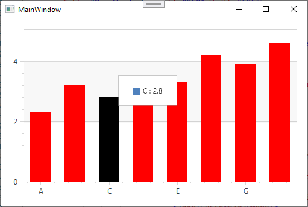

<!-- default badges list -->

<!-- default badges end -->

# Chart for WPF - How to Customize the Appearance of Selected Series Points

This example shows how to create a custom series model and change the selection color for series points.

         

1. Create an object that represents a custom model of a particular series [CustomBar2DModel](https://docs.devexpress.com/WPF/DevExpress.Xpf.Charts.CustomBar2DModel) and assign it to the `Model` property of a corresponding series type ([BarSeries2D.Model](https://docs.devexpress.com/WPF/DevExpress.Xpf.Charts.BarSeries2D.Model)).

2. Create the `System.Windows.Controls.ControlTemplate` object which contains a Border element to create your own custom model.

3. Assign this template to the `PointTemplate` property of a custom series model ([CustomBar2DModel.PointTemplate](https://docs.devexpress.com/WPF/DevExpress.Xpf.Charts.CustomPie2DModel.PointTemplate)).

4. Create the `IsSelectedConverter`. For this, create the `IsSelectedToBrushConverter` class inherited from `IValueConverter`. Then, implement `Convert`  and `ConvertBack` methods. The `Convert` method returns black if the `IsSelected` value is `true`; otherwise, red.

5. Bind the `Border.Background` property to the [SeriesPointPresentationData.IsSelected](https://docs.devexpress.com/WPF/DevExpress.Xpf.Charts.SeriesPointPresentationData.IsSelected) property with `IsSelectedToBrushConverter` from the static resource. Set the [ChartControl.SelectionMode](https://docs.devexpress.com/WPF/DevExpress.Xpf.Charts.ChartControl.SelectionMode) property to `Multiple` to enable chart selection. 

## Files to Review

* [MainWindow.xaml](./CS/CustomModelSelectedPointsCustomization/MainWindow.xaml) (VB: [MainWindow.xaml](./VB/CustomModelSelectedPointsCustomization/MainWindow.xaml))
* [MainWindow.xaml.cs](./CS/CustomModelSelectedPointsCustomization/MainWindow.xaml.cs) (VB: [MainWindow.xaml.vb](./VB/CustomModelSelectedPointsCustomization/MainWindow.xaml.vb))

## Documentation

* [Series Points](https://docs.devexpress.com/WPF/6340/controls-and-libraries/charts-suite/chart-control/series/series-points)

<!-- feedback -->
## Does this example address your development requirements/objectives?

 

(you will be redirected to DevExpress.com to submit your response)
<!-- feedback end -->
